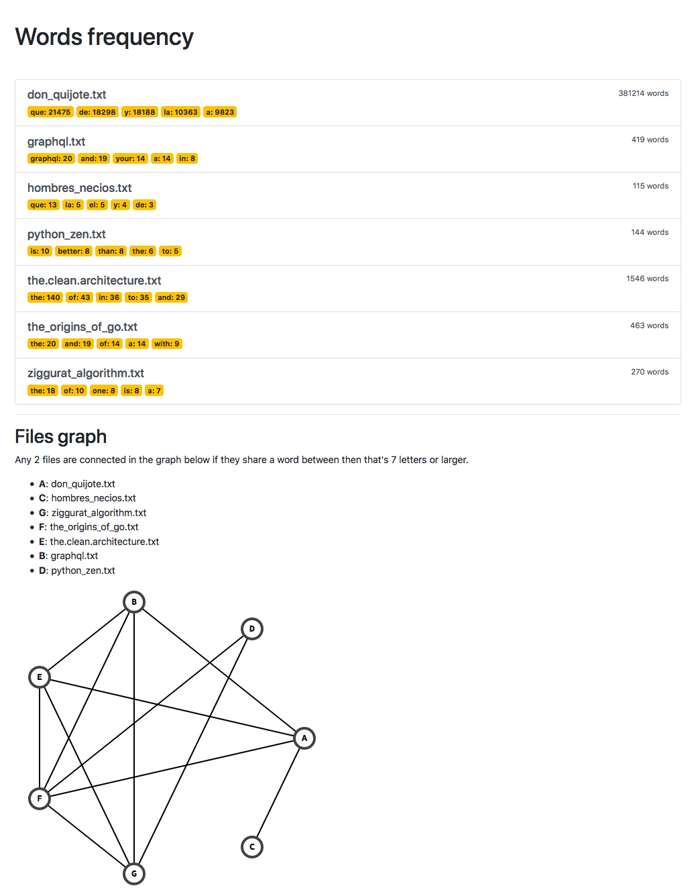
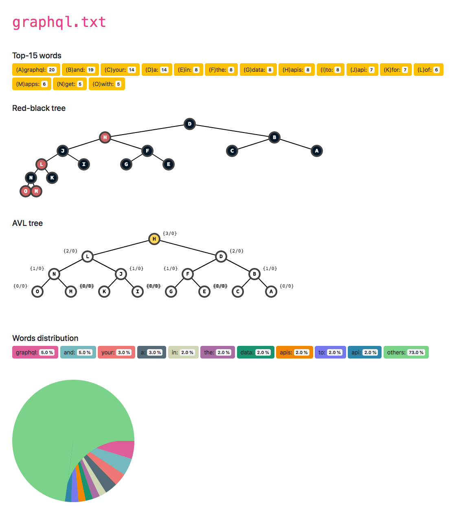
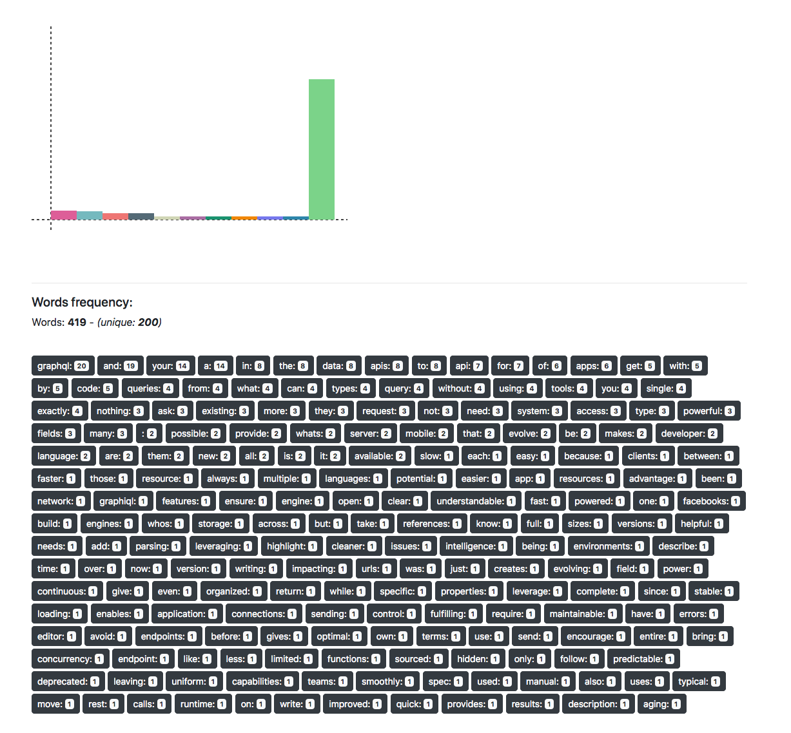

# Data Structures (course)

This repository contain the project and problem sets of the **Data Structures**
course I took as part of my CS Curriculum at UNAM's Faculty of Science
(*Facultad de Ciencias de la Universidad Autónoma Nacional de México, UNAM.*).
imparted by [@canek-pelaez](https://github.com/canek-pelaez) in the first half
of 2019.

## Coursework description

**@canek-pelaez**'s course focus was to understand data structures from a
computational complexity point of view and also from an engineering point of
view where he focused a lot on the implementation details using Java.

### Problem sets

All problem set assignments goal was to implement a data structure completing
some boilerplate code provided at the beginning of each one. The missing pieces
of each data structures where primarily its algorithms, e.g.: In balanced binary
trees, the task was to complete the algorithms that enable the data structure to
have insertions, lookups, sorting, etc.

The final result of the problem sets is a collection of all the data structures
reviewed in the course so you can navigate the source chronologically by
starting with [problem set 01 (linked lists)](psets/01) and see the final result
at [problem set 12 (optimized graphs using hash maps)](psets/12). Here's a list
of all data structures by problem set:

* [01 - Linked lists](psets/01)
* [02 - stacks, queues & sorting and search algorithms](psets/02)
* [03 - Binary trees](psets/03)
* [04 - Red-black trees](psets/04)
* [05 - AVL trees](psets/05)
* [06 - Graphs](psets/06)
* [07 - Linked Lists](psets/07)
* [08 - Heaps](psets/08)
* [09 - Graphs traversal & Dijkstra](psets/09)
* [10 - Hash functions](psets/10)
* [11 - Hash maps](psets/11)
* [12 - Optimized graphs using hash maps](psets/12)

Each problem set includes the original task description along with a commit
with the given boilerplate (you'll have to search through the history, sorry).

### Projects

Over the course 3 projects were assigned, this is what they were about:

#### [01 - Lexicographic sort](projects/01)

Create a program that reads either from a text file or from the standard input 
and sorts its content lexicographically.

#### [02 - Data structures visualizer](projects/02)

By far the most interesting of them all, given an specific data structure
an its content, create a program that output an SVG file that represent that
structure. Here are some of the results:****

* Red-black trees:

* Graphs

* Mean-heaps (array representation):

For graphs I implemented a super cool heuristic proposed in 1991 by Frutchman
and Reingold in [Graph Drawing by Force-directed placement](http://citeseer.ist.psu.edu/viewdoc/download?doi=10.1.1.13.8444&rep=rep1&type=pdf)
Although @canek-pelaez was ULTRA STRICT and disallowed me to use any code
coming from `java.util` so my heuristic had to be implemented without the
use of pseudo-random generated numbers 💔😭 and most of the complex graphs
were layed out symmetrically leaving behind the awesome, weird, and beautiful 
outcomes expected by the algorithm.

#### [03 - Word frequency counter with HTML reports](projects/03)

Create a program that reads from a text files and count the words frequency and
then generate an HTML website with the report which uses the SVGs of balanced
binary trees that the previous project was able to create.

Something cool about this project was that I created a template system that
mimics that of [Django's](https://github.com/django/django).

* `index.html`

* `file.html`

## License

This project follows **GNU General Public License v3.0** which you can fully
read [**here**](LICENSE)