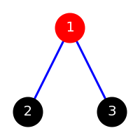
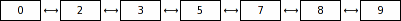
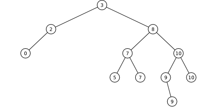
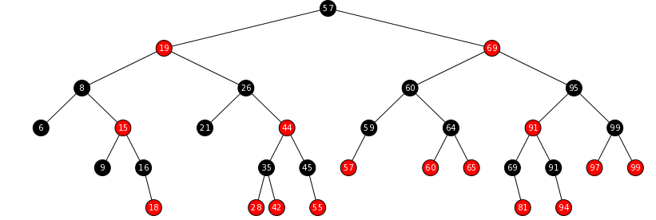
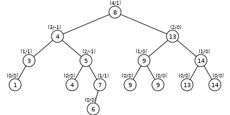

Estructuras de Datos
====================

Proyecto 2
----------

### Fecha de entrega: viernes 27 de abril, 2019

Deben escribir un programa para graficar las estructuras de datos que hemos
cubierto a lo largo del curso (hasta la práctica 7), utilizando SVG.

SVG es un lenguaje descriptivo para gráficos escalares muy sencillo. Por
ejemplo, la siguiente imagen:



se genera con el siguiente código SVG:

```xml
<?xml version='1.0' encoding='UTF-8' ?>
<svg width='200' height='200'>
  <g>
    <line x1='100' y1='40' x2='40' y2='160' stroke='blue' stroke-width='3' />
    <line x1='100' y1='40' x2='160' y2='160' stroke='blue' stroke-width='3' />
    <circle cx='100' cy='40' r='20' stroke='red' stroke-width='3' fill='red' />
    <circle cx='40' cy='160' r='20' stroke='black' stroke-width='3' fill='black' />
    <circle cx='160' cy='160' r='20' stroke='black' stroke-width='3' fill='black' />
    <text fill='white' font-family='sans-serif' font-size='20' x='100' y='45'
          text-anchor='middle'>1</text>
    <text fill='white' font-family='sans-serif' font-size='20' x='40' y='165'
          text-anchor='middle'>2</text>
    <text fill='white' font-family='sans-serif' font-size='20' x='160' y='165'
          text-anchor='middle'>3</text>
  </g>
</svg>
```

Las listas se deben ver de la siguiente manera:



Los árboles binarios, de la siguiente:



Los árboles rojinegros de la siguiente:



Y los árboles AVL de la siguiente:



Decidir cómo deben verse las gráficas (cómo acomodar los vértices y cómo
conectarlos), es parte de lo que tienen que resolver para el proyecto. Pilas,
colas y el resto de las otras clases debería ser trivial.

El programa escribirá su salida en la salida estándar, y recibirá su entrada a
través de un nombre de archivo o de la entrada estándar (si no se especifica
ningún nombre de archivo en la línea de comandos). El formato del archivo es el
siguiente:

1. Los espacios (incluyendo tabuladores, saltos de línea y cualquier otro
   carácter no imprimible) son ignorados excepto como separadores.
2. Si el programa encuentra una almohadilla (el símbolo `#`), se ignoran todos los
   siguientes caracteres hasta el fin de línea.
3. Lo primero que debe encontrar el programa es el nombre de una de las clases
   concretas permitidas.
4. Después del nombre de clase deben venir enteros (siempre enteros) que son los
   elementos de la estructura.
5. En el caso de las gráficas, el número de elementos debe ser par, y cada par
   de elementos es una arista. Si un par de elementos son iguales, esto
   representa un vértice desconectado del resto de la gráfica.

Por ejemplo, el siguiente archivo:

```
ArbolRojinegro 1 2 3 4 5 6 7 8 9 10 11 12 13 14 5
```

describe el mismo árbol rojinegro que el siguiente archivo:

```
# Clase:
        ArbolRojinegro
    # Elementos:
    1 2 3 4
# Más elementos
5 6 7 8
                        # Todavía MÁS elementos
                        9 10 11 12
    # Los últimos elementos
    13 14 5
```

Su programa deberá cumplir las siguientes reglas:

1. Deben usar las clases vistas en el curso, y no pueden utilizar ninguna clase
   del paquete `java.util`; excepciones e interfaces están permitidas.
2. No pueden modificar las clases del curso: no pueden agregarles ni métodos ni
   variables de clase, no importa el acceso. Tampoco pueden modificar los
   nombres de paquetes. Deben utilizar las clases con el comportamiento que se
   les ha definido a lo largo del curso.
3. Las clases de su proyecto (no las de las prácticas) deben usar el paquete
   `mx.unam.ciencias.edd.proyecto2`.
4. Deben procesar el archivo de entrada en tiempo *O*(*n*).
5. Su programa debe ser robusto frente a errores; si se les proporciona un
   archivo con el formato incorrecto, o con ligeros errores, el programa no debe
   lanzar una excepción: debe mostrar un mensaje (al error estándar) explicando
   qué ocurrió, y terminar con gracia.
6. Dependiendo de qué tan agradables visualmente sean los gráficos SVG
   generados, se podrán ganar un punto extra. El profesor arbitrariamente
   decidirá qué es "agradable visualmente".

El proyecto se entregará **únicamente al profesor**.