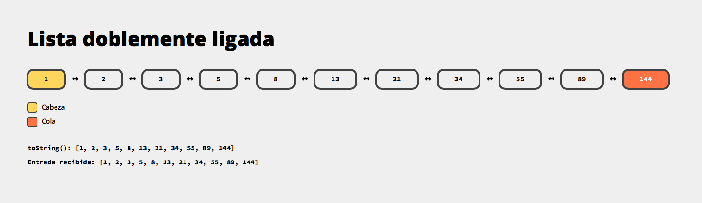
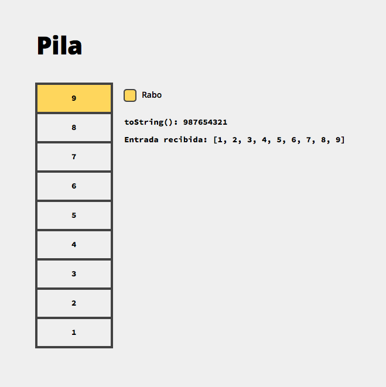
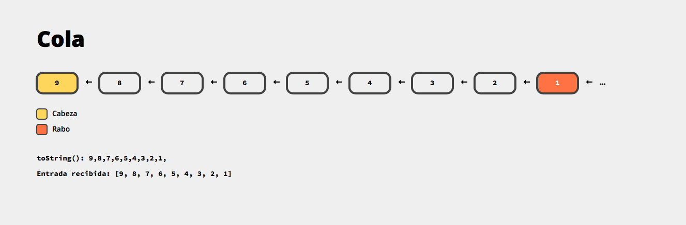
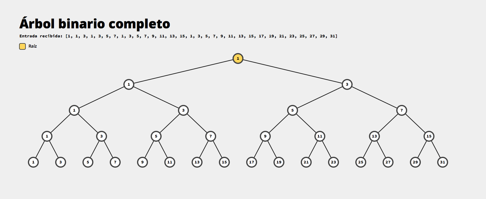
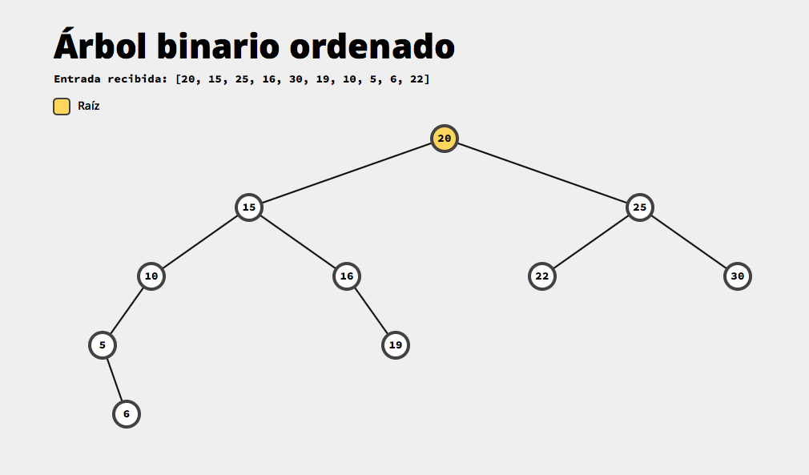
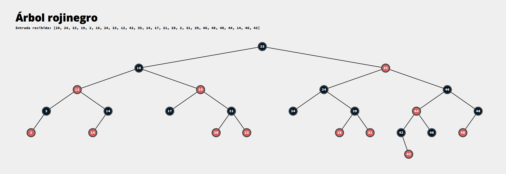
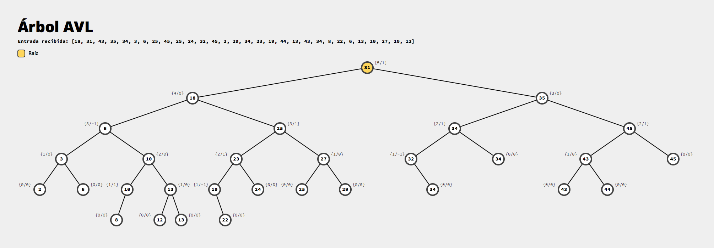

# Proyecto 2

Generador de SVGs de estructuras de datos.

Éste proyecto expone un programa que recibe información, a través de la
entrada estándar o un archivo, sobre una estructura de datos particular
como su nombre y los datos con los que ésta debe ser inicializada, 
y genera su representación gráfica en SVG (salida estándar o en archivo).

Para más detalles, leer la [descripción original](Proyecto-2.md).

## Instalación

El proyecto puede construirse y probarse utilizando maven. Los siguientes
comandos están disponibles:

* **`mvn test`**: Ejecuta las pruebas unitarias
* **`mv package`**: Ejecuta las pruebas unitarias y crea el paquete
  **`dsdrawer.java`** dentro del folder objetivo **`target/`**.

## Uso

El `.jar` puede ser ejecutado utulizando el comando

```bash
$ java -jar dsdrawer.jar
```

Además, se puede ejecutar junto con la bandera `-h` para obtener más
información acerca del uso del mismo.

Algunos ejemplos son:

* `$... dsdrawer.jar input.txt`: Recibe la descripción del archivo `input.txt`
* `$ cat input.txt | ... dsdrawer.jar` Recibe la descripción de `input.txt` a
  través de la entrada estándar.
* `$... dsdrawer.jar input.txt -o output.svg`: Recibe la descripción del archivo
  `input.txt` y escribe el resultado en el archivo `output.svg`.

## Ejemplo de los resultados obtenidos

### Listas doblemente ligadas


### Pilas


### Colas


### Arreglos (adicional)


### Árboles binarios completos


### Árboles binarios ordenados


### Árboles Rojinegros


### Árboles AVL


## Autores

* [**Pablo Trinidad**](https://github.com/pablotrinidad): Número de cuenta 419004279