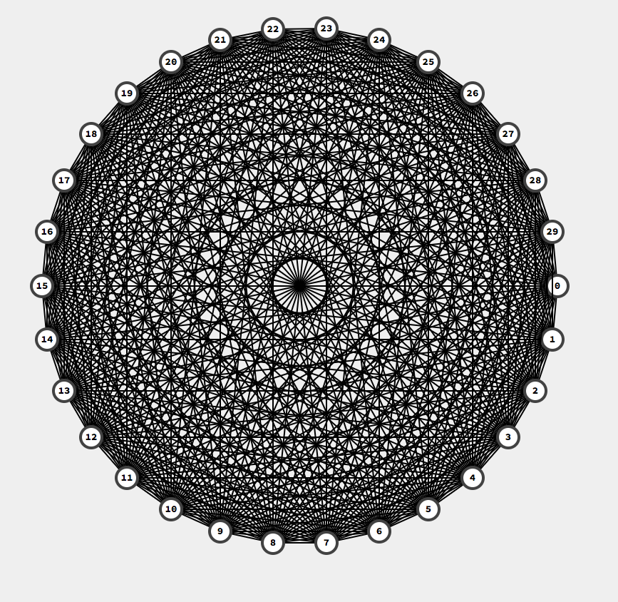
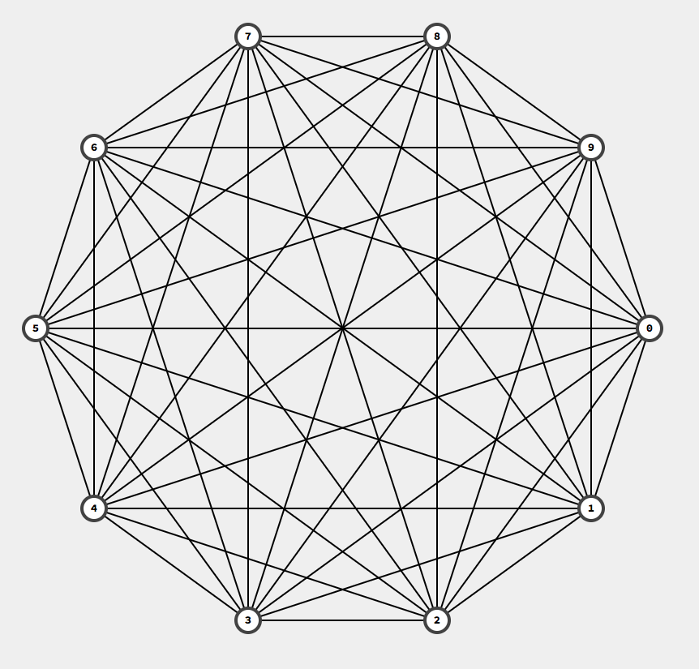
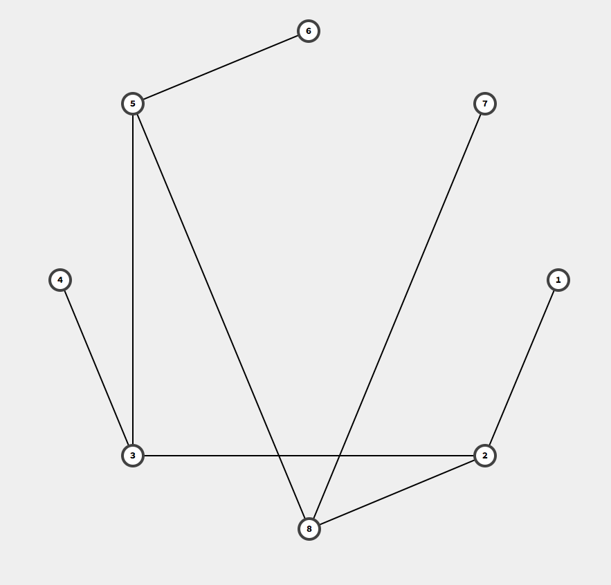
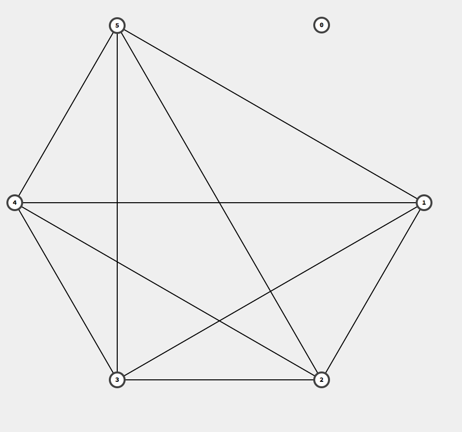
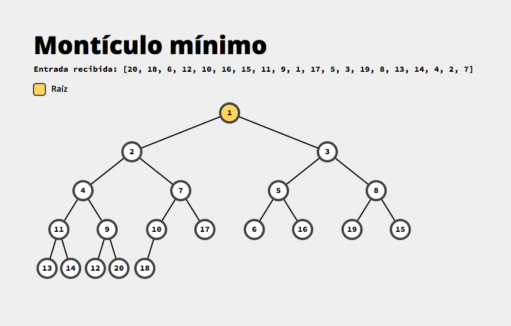
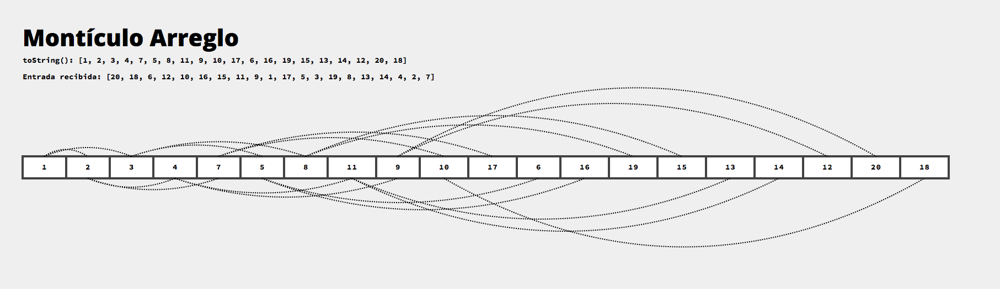

# Proyecto 2

Generador de SVGs de estructuras de datos.

Éste proyecto expone un programa que recibe información, a través de la
entrada estándar o un archivo, sobre una estructura de datos particular
como su nombre y los datos con los que ésta debe ser inicializada, 
y genera su representación gráfica en SVG (salida estándar o en archivo).

Para más detalles, leer la [descripción original](Proyecto-2.md).

## Instalación

El proyecto puede construirse y probarse utilizando maven. Los siguientes
comandos están disponibles:

* **`mvn test`**: Ejecuta las pruebas unitarias
* **`mv package`**: Ejecuta las pruebas unitarias y crea el paquete
  **`dsdrawer.jar`** dentro del folder objetivo **`target/`**.

## Uso

El `.jar` puede ser ejecutado utilizando el comando

```bash
$ java -jar dsdrawer.jar
```

Además, se puede ejecutar junto con la bandera `-h` para obtener más
información acerca del uso del mismo.

Algunos ejemplos son:

* `$... dsdrawer.jar input.txt`: Recibe la descripción del archivo `input.txt`
* `$ cat input.txt | ... dsdrawer.jar` Recibe la descripción de `input.txt` a
  través de la entrada estándar.
* `$... dsdrawer.jar input.txt -o output.svg`: Recibe la descripción del archivo
  `input.txt` y escribe el resultado en el archivo `output.svg`.

Adicionalmente, junto con el proyecto se incluye el folder `test_files` con
descripciones ejemplo para cada una de las estructuras y un archivo ejecutable
**`build_figures.sh`** que lee el contenido de dicho folder y genera el SVG
para cada uno de los archivos que ahí se encuentre. Se puede utilizar de
la siguiente manera:

```bash
$ chmod +x build_figures.sh
$ ./build_figures.sh
```

## Ejemplo de los resultados obtenidos

### Listas doblemente ligadas


### Pilas


### Colas


### Arreglos (adicional)


### Árboles binarios completos


### Árboles binarios ordenados


### Árboles Rojinegros


### Árboles AVL


### Gráficas

Las gráficas siguen el algoritmo propuesto por Frutchman y Reingold
en [*Graph Drawind by Force-directed placement*](http://citeseer.ist.psu.edu/viewdoc/download?doi=10.1.1.13.8444&rep=rep1&type=pdf) en **1991**.

Por alguna razón toda gráfica que le doy parece converger
en una distribución dentro de un polígono regular aunque el algoritmo claramente
no tiene ningún sesgo hacia esa forma. Me parece que se debe a que la distribución
inicial de los nodos sucede al rededor de un círculo en lugar de suceder
de manera aleatoria como el paper lo menciona. Me gustaría mucho poder jugar
más con las variables del algoritmo así como con las diferentes *cooling strategies*.
Para ver más trabajo mío sobre *cooling strategies*, particularmente simulated annealing,
revisar el siguiente [link](https://github.com/pablotrinidad/evolutionary-computation/tree/master/psets/03).





### Montículo mínimo



### Montículo arreglo


## Autores

* [**Pablo Trinidad**](https://github.com/pablotrinidad): Número de cuenta 419004279